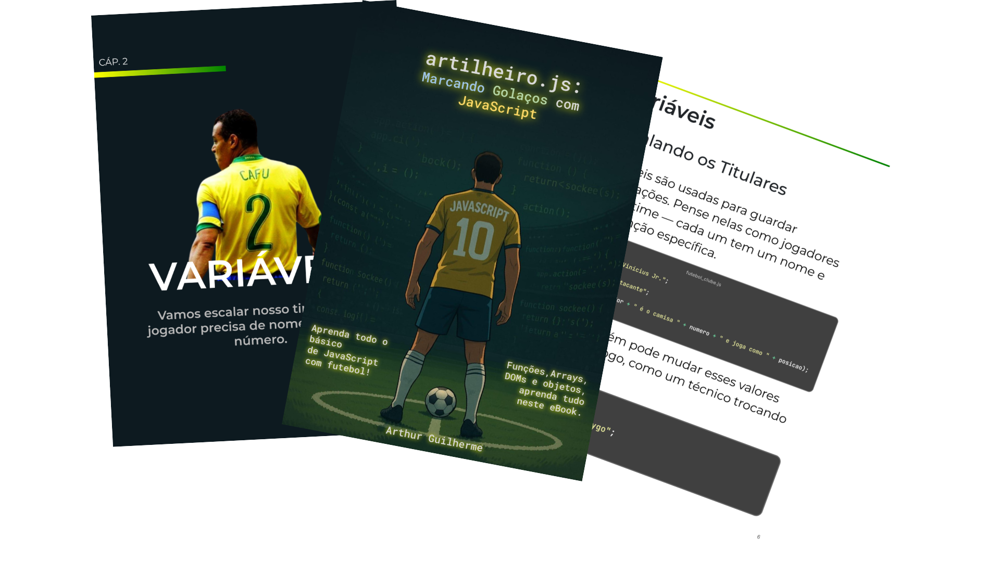

    

-------

# Projeto EBOOK Gerado por I.A.s

 > ℹ️ **NOTE:** Este repositório é um fork do projeto desenvolvido por um curso na plataforma da [DIO](https://dio.me)

Projeto original:

<a href="https://github.com/felipeAguiarCode/prompts-recipe-to-create-a-ebook/blob/main/output/ebook%20-%20css%20jedi%20output.pdf" title="View PDF now"> 📕Clique aqui para ler</a>

Projeto com o objetivo de gerar um ebook digital com as facilidades das ferramentas de IA. todos os prompts e ferramentas
seguem abaixo.

## 💻 Tecnologias utilizadas no projeto

- [ChatGPT](https://chat.openai.com/) 
- [Gemini](https://gemini.google.com/app/)
- [Google Apresentações](https://docs.google.com/presentation/)

## 🧠 Prompts

ChatGPT：

|   Ação   | prompt                                                                                                                                                                                                                                                                           |
| :------: | -------------------------------------------------------------------------------------------------------------------------------------------------------------------------------------------------------------------------------------------------------------------------------- |
|  imagem  | crie uma imagem no tamanho de um papel a4 de um jogador de futebol num estadio em ambiente escuro, em que ele está na marca do penalti. a camisa dele tem "javascript" atrás e o numero 10.  no lugar de torcedores nas arquibancadas, troque por códigos flutuantes que se assemelham a javascript. a imagem, dentro da proporção a4 deve conter um espaço livre acima para adicionar um título de ebook                                                                                           |
| conteúdo | faça um texto para um ebook, com foco em introdução a javascript com tematica de futebol. - faça uma didatica leve com o futebol - foque no ensino .js mas insira tambem o futeebol em alguns pontos - explique sempre de maneira simples - deixe o texto enxuto - sempre traga exemplos de código leves e do futebol - sempre deixe um titulo sugestivo por topico |

Gemini：

|  Ação  | prompt                                                                                                                                                                                                                                                                            |
| :----: | --------------------------------------------------------------------------------------------------------------------------------------------------------------------------------------------------------------------------------------------------------------------------------- |
| título | crie um titulo de um ebook sobre o tema de javascript, o ebook é do nicho do tema de programação, com o subtema de javascript. o titulo deve ser épico e curto e tenha uma temática mais futebolistica, me entregue 5 títulos                                                   |

## ✨ Features

- Conteúdo e imagens gerados via ChatGPT
- Título gerado via Gemini

## 📚 Materiais

- Imagens utilizadas em `assets`
- ebook gerado durante as aulas em `output`

## 🛠️ Instruções de execução

Utilize os prompts acima nas ferramentas sugeridas para gerar o material base e utilize uma ferramenta de edição de documentos como power point, libreoffice , indesign para diagramação.

## 👨‍💻 Expert

    
    
&nbsp&nbsp&nbspFelipe Aguiar 
    &nbsp&nbsp&nbsp
    <a href="https://github.com/felipeAguiarCode">
    GitHub</a>&nbsp;|&nbsp;
    <a href="www.linkedin.com/in/
felipe-exe">LinkedIn</a>
&nbsp;|&nbsp;
    <a href="https://www.instagram.com/felipeaguiar.exe/">
    Instagram</a>
&nbsp;|&nbsp;

  

---

⌨️ com 💜 por [Felipe Aguiar](https://github.com/felipeAguiarCode)
